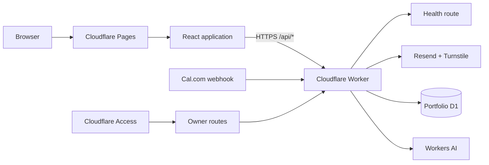

# Architecture

## Repository boundaries

The repository is an npm workspace with three independently owned packages:

- `app/frontend` is a React single-page application built by Vite. It contains presentation code and public configuration only.
- `app/backend` is a Cloudflare Worker. It owns request validation, secrets, rate limits, and future third-party integrations.
- `packages/shared` contains serializable TypeScript contracts used on both sides of the HTTP boundary.

## Content ownership

Editable biography, external links, and working principles are in `app/frontend/src/content/site.ts`. Project copy and status are in `app/frontend/src/content/projects.ts`. Components consume those files and should not become a second source of editorial content.

GitHub and LinkedIn are ordinary external links. Interview scheduling uses Cal.com's public browser embed on the Contact route with a direct HTTPS link as its fallback. This public booking integration does not require credentials; any future authenticated scheduling or webhook work belongs in the Worker and must use Cloudflare secrets.

Page modules are loaded by route so the contact form and Cal.com integration are not part of the initial home-page chunk. The profile image is a reviewable, optimized WebP source asset. Cloudflare Pages copies `_headers`, `robots.txt`, `sitemap.xml`, and the web app manifest from the public directory into the build output.

All three public projects remain labeled `Prototype - in development`. Synthetic data is required for future demos.

## API behavior

- `GET /api/health` returns service status and a timestamp.
- `POST /api/contact` accepts a bounded JSON payload, enforces the configured browser origin, validates fields, rate-limits submissions, verifies Turnstile, stores the message in D1 idempotently by submission ID, and then delivers through Resend. Owner-notification and confirmation states are tracked separately; failed deliveries are retried by the daily scheduled job or from the owner page. It fails closed when a required binding or secret is missing.
- `POST /api/ask` validates the request, origin, rate limit, and Turnstile (`ask_branden` action), then searches the active approved passage version with D1 FTS5. With no matching evidence it returns portfolio links and never calls the model. When `AI_ENABLED=true` and the owner kill switch allows it, the Worker atomically reserves the daily allowance (5 per browser, 15 per network, 100 site-wide) in one D1 batch before calling Workers AI, validates cited passage IDs, and builds evidence links itself. Questions and job descriptions are never stored or logged.
- `GET /api/ask/status` is origin-checked and read-only. It reports whether generated answers are enabled and the visitor's allowance (browser usage, the tightest remaining count across all three scopes, and the next UTC reset) without reserving capacity or issuing a visitor cookie.
- `POST /api/webhooks/cal` verifies the `x-cal-signature-256` HMAC, accepts only booking created, rescheduled, and cancelled events for the configured event type, deduplicates deliveries, and ignores events older than the stored state. Only attendee name, email, times, and status are kept.
- `/api/owner/*` requires a valid Cloudflare Access JWT for `OWNER_EMAIL` (issuer, audience, signature, and expiry are verified in the Worker) and the exact site origin for changes. It lists, searches, updates, retries, exports, and deletes history, records manual bookings, and toggles generated answers.
- A daily cron retries due contact deliveries and deletes contacts and bookings 12 months after their last interaction, quota counters after 7 days, and usage totals after 90 days.

Approved Ask evidence is generated from `app/frontend/src/content/` by `app/backend/scripts/build-knowledge-sql.ts`, so the site and the assistant share one source of truth. Passage IDs and page anchors both come from `app/frontend/src/content/anchors.ts`, so each evidence link targets the exact résumé role, skill group, project, or About item. D1 holds a versioned, searchable copy; each sync activates the new version and removes older ones. Retrieval quality is checked against `app/backend/evaluation/ask-evaluation.json` in the test suite.

The Worker allows browser requests only from the configured `ALLOWED_ORIGIN`, with credentials for the anonymous Ask cookie and the Access session. Production secrets belong in Cloudflare Worker secrets, never Vite environment variables or Git.

Every API response is non-cacheable and includes baseline response-hardening headers plus an opaque request ID. Structured completion and failure logs contain the route, method, status, duration, and request ID only; names, email addresses, message content, Turnstile tokens, and provider secrets are deliberately excluded.

## Quality boundaries

- Vitest covers both packages and enforces repository coverage thresholds.
- ESLint includes TypeScript, React Hooks, and JSX accessibility rules.
- jscpd checks maintained TypeScript, TSX, and CSS while excluding generated Worker bundles and test fixtures.
- GitHub Actions repeats lint, test coverage, duplication, type checks, builds, and production dependency auditing.
- A separate production job runs only after those checks pass on `main`. It receives Cloudflare deployment credentials from the protected GitHub `production` environment; application secrets remain exclusively in Cloudflare Worker secrets.
- CodeQL and Dependabot provide scheduled security and maintenance signals.

The root `undici` development dependency and npm override pin Wrangler's local Miniflare dependency to the patched 7.29.1 release. Keep that override until Wrangler declares the patched version directly; Dependabot and the audit gate will surface when it can be removed safely.
