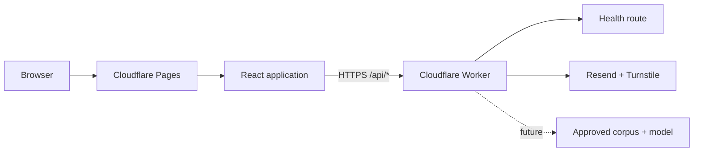

# Architecture

## Repository boundaries

The repository is an npm workspace with three independently owned packages:

- `app/frontend` is a React single-page application built by Vite. It contains presentation code and public configuration only.
- `app/backend` is a Cloudflare Worker. It owns request validation, secrets, rate limits, and future third-party integrations.
- `packages/shared` contains serializable TypeScript contracts used on both sides of the HTTP boundary.

## Content ownership

Editable biography, external links, and working principles are in `app/frontend/src/content/site.ts`. Project copy and status are in `app/frontend/src/content/projects.ts`. Components consume those files and should not become a second source of editorial content.

GitHub and LinkedIn are ordinary external links. Interview scheduling uses Cal.com's public browser embed on the Contact route with a direct HTTPS link as its fallback. This public booking integration does not require credentials; any future authenticated scheduling or webhook work belongs in the Worker and must use Cloudflare secrets.

Page modules are loaded by route so the contact form and Cal.com integration are not part of the initial home-page chunk. The profile image is a reviewable, optimized WebP source asset. Cloudflare Pages copies `_headers`, `robots.txt`, `sitemap.xml`, and the web app manifest from the public directory into the build output.

All three public projects remain labeled `Prototype - in development`. Synthetic data is required for future demos.

## API behavior

- `GET /api/health` returns service status and a timestamp.
- `POST /api/contact` accepts a bounded JSON payload, enforces the configured browser origin, validates fields, rate-limits submissions, verifies Turnstile, and delivers through Resend. It fails closed when a required binding or secret is missing.
- `POST /api/ask` returns `501` until an approved corpus, retrieval, evaluation, moderation, and model budget controls are configured.

The Worker allows browser requests only from the configured `ALLOWED_ORIGIN`. Contact messages are not stored by the application. Production secrets belong in Cloudflare Worker secrets, never Vite environment variables or Git.

Every API response is non-cacheable and includes baseline response-hardening headers plus an opaque request ID. Structured completion and failure logs contain the route, method, status, duration, and request ID only; names, email addresses, message content, Turnstile tokens, and provider secrets are deliberately excluded.

## Quality boundaries

- Vitest covers both packages and enforces repository coverage thresholds.
- ESLint includes TypeScript, React Hooks, and JSX accessibility rules.
- jscpd checks maintained TypeScript, TSX, and CSS while excluding generated Worker bundles and test fixtures.
- GitHub Actions repeats lint, test coverage, duplication, type checks, builds, and production dependency auditing.
- A separate production job runs only after those checks pass on `main`. It receives Cloudflare deployment credentials from the protected GitHub `production` environment; application secrets remain exclusively in Cloudflare Worker secrets.
- CodeQL and Dependabot provide scheduled security and maintenance signals.

The root `undici` development dependency and npm override pin Wrangler's local Miniflare dependency to the patched 7.29.1 release. Keep that override until Wrangler declares the patched version directly; Dependabot and the audit gate will surface when it can be removed safely.
